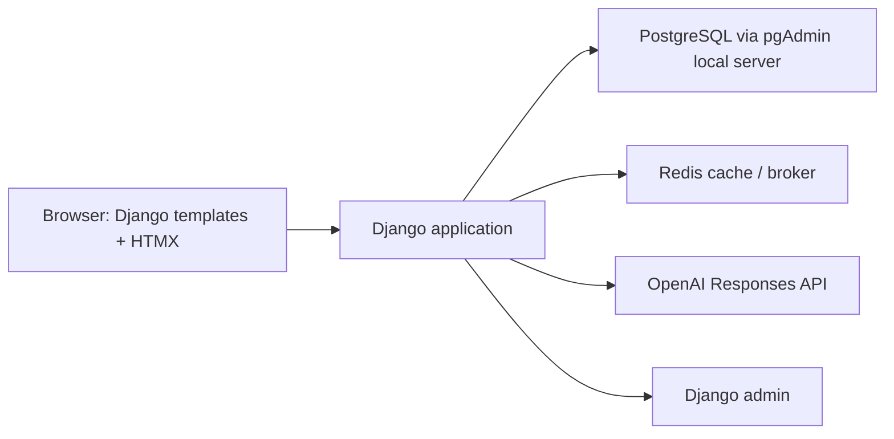
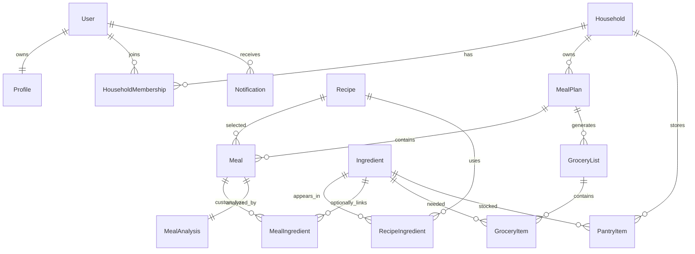
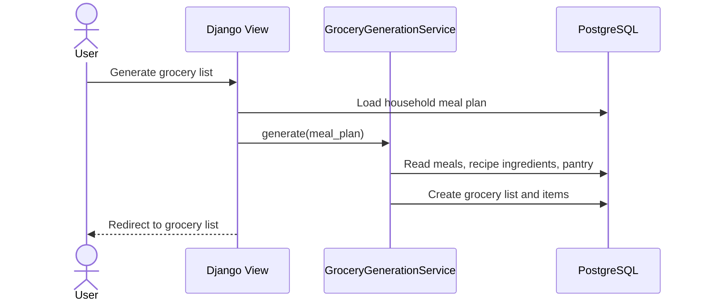

# EatFit Diagrams

## Architecture

```mermaid
flowchart LR
    Browser["Browser: Django templates + HTMX"] --> Django["Django application"]
    Django --> Postgres["PostgreSQL via pgAdmin local server"]
    Django --> Redis["Redis cache / broker"]
    Django --> OpenAI["OpenAI Responses API"]
    Django --> Admin["Django admin"]
```

## ERD

```mermaid
erDiagram
    User ||--|| Profile : owns
    Household ||--o{ HouseholdMembership : has
    User ||--o{ HouseholdMembership : joins
    Household ||--o{ MealPlan : owns
    MealPlan ||--o{ Meal : contains
    Recipe ||--o{ Meal : selected
    Meal ||--o{ MealIngredient : custom_has
    Meal ||--|| MealAnalysis : analyzed_by
    Recipe ||--o{ RecipeIngredient : uses
    Ingredient ||--o{ RecipeIngredient : appears_in
    Ingredient ||--o{ MealIngredient : optionally_links
    MealPlan ||--o{ GroceryList : generates
    GroceryList ||--o{ GroceryItem : contains
    Ingredient ||--o{ GroceryItem : needed
    Household ||--o{ PantryItem : stores
    Ingredient ||--o{ PantryItem : stocked
    User ||--o{ Notification : receives
```

## Grocery Generation Sequence

```mermaid
sequenceDiagram
    actor User
    participant View as Django View
    participant Grocery as GroceryGenerationService
    participant DB as PostgreSQL
    User->>View: Generate grocery list
    View->>DB: Load household meal plan
    View->>Grocery: generate(meal_plan)
    Grocery->>DB: Read meals, recipe ingredients, pantry
    Grocery->>DB: Create grocery list and items
    View-->>User: Redirect to grocery list
```
